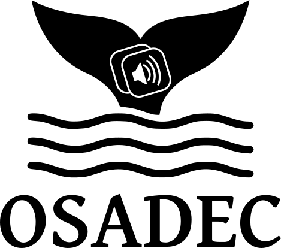

<!-- insert logo below-->

  <picture>
  <source media="(prefers-color-scheme: dark)" srcset="./app/static/images/logo_white.png">
  
  </picture>

___

**O**cean **S**ound **A**ssistant for **DE**tection and **C**lassification (OSADEC) is a open-source project to help in labbelling marine mammal calls in records.

## Get started
___

For the moment the application only can be use in local, to deploy it in your computer use the [doc : Deploy in local](./docs/deploy_local.md)
